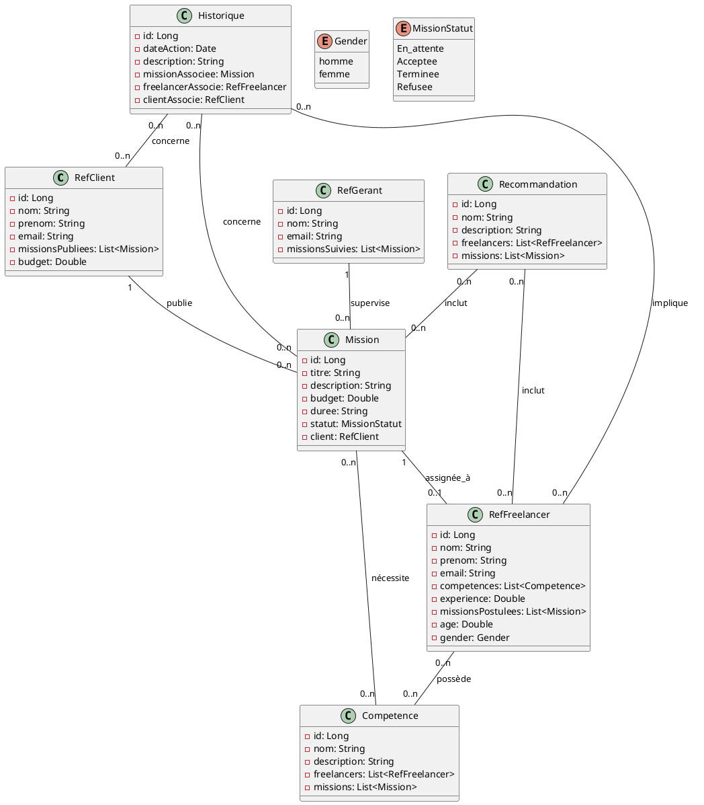

##Diagramme de classe

```plantuml
@startuml
' Définition des classes
class RefClient {
    - id: Long
    - nom: String
    - prenom: String
    - email: String
    - missionsPubliees: List<Mission>
    - budget: Double
}
 
class RefFreelancer {
    - id: Long
    - nom: String
    - prenom: String
    - email: String
    - competences: List<Competence>
    - experience: Double
    - missionsPostulees: List<Mission>
    - age: Double
    - gender: Gender
}
 
class Mission {
    - id: Long
    - titre: String
    - description: String
    - budget: Double
    - duree: String
    - statut: MissionStatut
    - client: RefClient
}
 
class RefGerant {
    - id: Long
    - nom: String
    - email: String
    - missionsSuivies: List<Mission>
}
 
class Recommandation {
    - id: Long
    - nom: String
    - description: String
    - freelancers: List<RefFreelancer>
    - missions: List<Mission>
}
 
class Historique {
    - id: Long
    - dateAction: Date
    - description: String
    - missionAssociee: Mission
    - freelancerAssocie: RefFreelancer
    - clientAssocie: RefClient
}
 
class Competence {
    - id: Long
    - nom: String
    - description: String
    - freelancers: List<RefFreelancer>
    - missions: List<Mission>
}
 
' Définition des énumérations
enum Gender {
    homme
    femme
}
 
enum MissionStatut {
    En_attente
    Acceptee
    Terminee
    Refusee
}
 
' Relations avec cardinalités
RefClient "1" -- "0..n" Mission : publie
Mission "1" -- "0..1" RefFreelancer : assignée_à
RefFreelancer "0..n" -- "0..n" Competence : possède
Mission "0..n" -- "0..n" Competence : nécessite
Recommandation "0..n" -- "0..n" RefFreelancer : inclut
Recommandation "0..n" -- "0..n" Mission : inclut
RefGerant "1" -- "0..n" Mission : supervise
Historique "0..n" -- "0..n" Mission : concerne
Historique "0..n" -- "0..n" RefFreelancer : implique
Historique "0..n" -- "0..n" RefClient : concerne
 
@enduml

Dispose d’un menu contextuel

```
